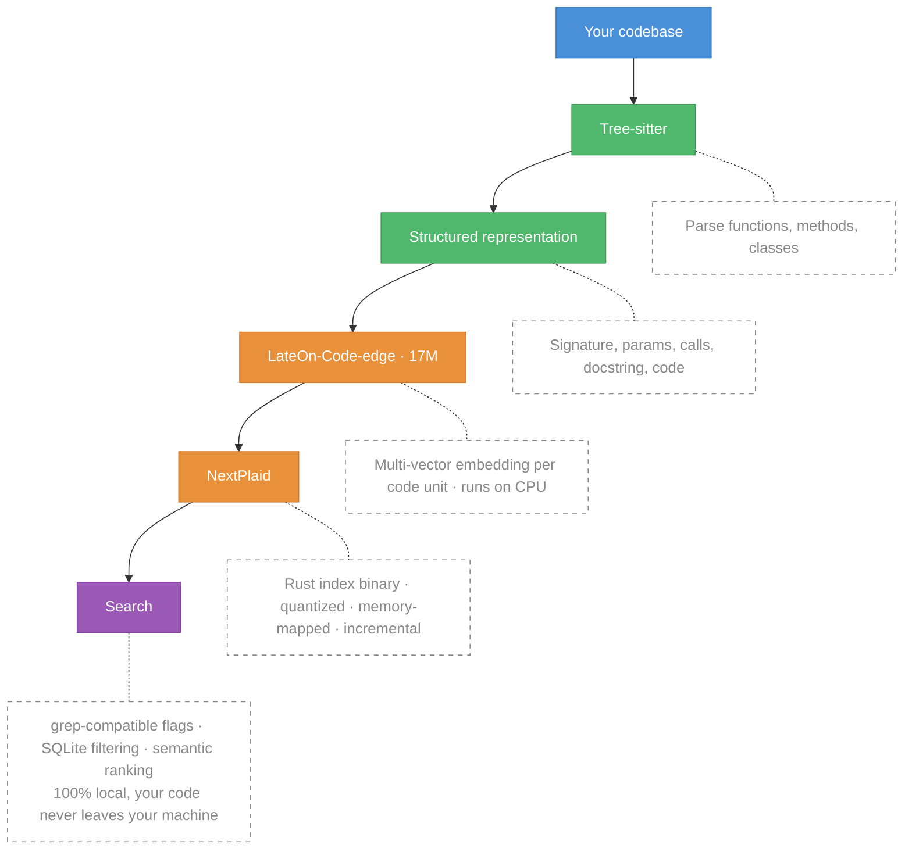

<div align="center">
  <h1>NextPlaid & ColGREP</h1>
  <p><b>NextPlaid</b> is a multi-vector search engine. <b>ColGREP</b> is semantic code search, built on it.</p>

  <p>
    <a href="colgrep/README.md"><b>ColGREP</b></a>
    ·
    <a href="next-plaid-api/README.md"><b>NextPlaid</b></a>
    ·
    <a href="#models"><b>Models</b></a>
  </p>
</div>

<p align="center">
  
</p>

---

## ColGREP

Semantic code search for your terminal and your coding agents. Searches combine regex filtering with semantic ranking. All local, your code never leaves your machine.

### Quick start

Install:

```bash
# Homebrew (macOS / Linux)
brew install lightonai/tap/colgrep

# Shell installer
curl --proto '=https' --tlsv1.2 -LsSf https://github.com/lightonai/next-plaid/releases/latest/download/colgrep-installer.sh | sh
```

Build the index:

```bash
colgrep init /path/to/project  # specific project
colgrep init                   # current directory
```

Search:

```bash
colgrep "database connection pooling"
```

That's it. No server, no API, no dependencies. ColGREP is a single Rust binary with everything baked in. `colgrep init` builds the index for the first time. After that, every search detects file changes and updates the index automatically before returning results.

Regex meets semantics:

```bash
colgrep -e "async.*await" "error handling"
```

### Change the model

The default is [`lightonai/LateOn-Code-edge`](https://huggingface.co/lightonai/LateOn-Code-edge). Switch to any other ColBERT-style model on HuggingFace:

```bash
# Persist as the default (existing indexes for other models are kept)
colgrep set-model lightonai/LateOn-Code

# One-shot override for a single query or init
colgrep --model lightonai/LateOn-Code "database connection pooling"

# See which model an index was built with
colgrep status

# Private HuggingFace model
HF_TOKEN=hf_xxx colgrep set-model myorg/private-model
```

Each (project, model) pair has its own index directory, so switching models never corrupts existing indexes and you can flip back and forth without re-indexing. `colgrep clear` scopes to the active model; `colgrep clear --all` wipes every index.

### Agent integrations

| Tool        | Install                         |
| ----------- | ------------------------------- |
| Claude Code | `colgrep --install-claude-code` |
| OpenCode    | `colgrep --install-opencode`    |
| Codex       | `colgrep --install-codex`       |
| Hermes      | `colgrep --install-hermes`      |

> Restart your agent after installing. Claude Code has full hooks support. OpenCode, Codex, and Hermes integrations are basic for now, PRs welcome.

### How it works



**What the model sees.** Each code unit is converted to structured text before embedding:

```python
# Function: fetch_with_retry
# Signature: def fetch_with_retry(url: str, max_retries: int = 3) -> Response
# Description: Fetches data from a URL with retry logic.
# Parameters: url, max_retries
# Returns: Response
# Calls: range, client.get
# Variables: i, e
# Uses: client, RequestError
# File: src/utils/http_client.py

def fetch_with_retry(url: str, max_retries: int = 3) -> Response:
    """Fetches data from a URL with retry logic."""
    for i in range(max_retries):
        try:
            return client.get(url)
        except RequestError as e:
            if i == max_retries - 1:
                raise e
```

This structured input gives the model richer signal than raw code alone.

**Documentation:** install variants, performance tuning, all flags and options → [ColGREP documentation](colgrep/README.md)

### Benchmark

<p align="center">
  <picture>
    <source media="(prefers-color-scheme: dark)" srcset="docs/colgrep-bench-dark.svg">
    
  </picture>
</p>

ColGREP against Semble public bench: 1,251 queries × 63 repos × 19 languages (FP32).

---

## Why multi-vector?

Standard vector search collapses an entire document into **one** embedding. That's a lossy summary. Fine for short text, bad for code where a single function has a name, parameters, a docstring, control flow, and dependencies.

Multi-vector keeps ~300 embeddings of dimension 128 per document instead of one. At query time, each query token finds its best match across all document tokens (**MaxSim**). More storage upfront. That's what NextPlaid solves with quantization and memory-mapped indexing.

---

## NextPlaid

A local-first multi-vector database with a REST API. It's what powers ColGREP under the hood, but it's a general-purpose engine you can use for any retrieval workload.

- **Built-in encoding.** Pass text, get results. Ships with ONNX Runtime for ColBERT models, no external inference server needed.
- **Memory-mapped indices.** Low RAM footprint, indices live on disk and are paged in on demand.
- **Product quantization.** 2-bit or 4-bit compression. A million documents fit in memory.
- **Incremental updates.** Add and delete documents without rebuilding the index.
- **Metadata pre-filtering.** SQL WHERE clauses on a built-in SQLite store. Filter _before_ search so only matching documents are scored.
- **CPU-optimized.** Designed to run fast on CPU. CUDA supported when you need it.

**NextPlaid vs [FastPlaid](https://github.com/lightonai/fast-plaid).** FastPlaid is a GPU batch indexer built for large-scale, single-pass workloads. NextPlaid wraps the same FastPlaid algorithm into a production API that handles documents as they arrive: incremental updates, concurrent reads/writes, deletions, and built-in encoding. Use FastPlaid for bulk offline indexing and experiments, NextPlaid for serving and streaming ingestion.

### Quick start

**Run the server (Docker):**

```bash
# CPU
docker pull ghcr.io/lightonai/next-plaid:cpu-1.3.1
docker run -p 8080:8080 -v ~/.local/share/next-plaid:/data/indices \
  ghcr.io/lightonai/next-plaid:cpu-1.3.1 \
  --host 0.0.0.0 --port 8080 --index-dir /data/indices \
  --model lightonai/answerai-colbert-small-v1-onnx --int8
```

```bash
# GPU
docker pull ghcr.io/lightonai/next-plaid:cuda-1.3.1
docker run --gpus all -p 8080:8080 -v ~/.local/share/next-plaid:/data/indices \
  ghcr.io/lightonai/next-plaid:cuda-1.3.1 \
  --host 0.0.0.0 --port 8080 --index-dir /data/indices \
  --model lightonai/GTE-ModernColBERT-v1 --cuda
```

**Query from Python:**

```bash
pip install next-plaid-client
```

```python
from next_plaid_client import NextPlaidClient, IndexConfig

client = NextPlaidClient("http://localhost:8080")

# Create index
client.create_index("docs", IndexConfig(nbits=4))

# Add documents, text is encoded server-side
client.add(
    "docs",
    documents=[
        "next-plaid is a multi-vector database",
        "colgrep is a code search tool based on NextPlaid",
    ],
    metadata=[{"id": "doc_1"}, {"id": "doc_2"}],
)

# Search
results = client.search("docs", ["coding agent tool"])

# Search with metadata filtering
results = client.search(
    "docs",
    ["vector-database"],
    filter_condition="id = ?",
    filter_parameters=["doc_1"],
)

# Delete by predicate
client.delete("docs", "id = ?", ["doc_1"])
```

**Or via the CLI** (`pip install "next-plaid-client[cli]"`):

```bash
next-plaid index create docs
next-plaid document add docs --text "hello world"
next-plaid search docs "hello"
```

Once the server is running: [Swagger UI](http://localhost:8080/swagger-ui) · [OpenAPI spec](http://localhost:8080/api-docs/openapi.json)

**Documentation:** REST API reference, Docker Compose, environment variables → [NextPlaid documentation](next-plaid-api/README.md)

---

## API Benchmarks

End-to-end benchmarks against the NextPlaid API on [BEIR](https://github.com/beir-cellar/beir) datasets. Documents are uploaded as raw text in parallel batches of 64. Search queries are sent as raw text, one at a time, with 16 concurrent workers to simulate real user traffic. All throughput numbers (docs/s, QPS) include encoding time — the model runs inside the API, so every document and query is embedded on the fly within the API.

**Setup:** `lightonai/GTE-ModernColBERT-v1` on NVIDIA H100 80GB, `top_k=100`, `n_ivf_probe=8`, `n_full_scores=4096`. CPU search uses INT8-quantized ONNX encoding on the same machine.

| Dataset  | Documents |    MAP | NDCG@10 | NDCG@100 | Recall@10 | Recall@100 | Indexing (docs/s) | GPU QPS | GPU P95 (ms) | CPU QPS | CPU P95 (ms) |
| -------- | --------: | -----: | ------: | -------: | --------: | ---------: | ----------------: | ------: | -----------: | ------: | -----------: |
| arguana  |     8,674 | 0.2457 |  0.3499 |   0.3995 |    0.7126 |     0.9337 |              77.1 |    13.6 |        170.1 |    17.4 |        454.7 |
| fiqa     |    57,638 | 0.3871 |  0.4506 |   0.5129 |    0.5184 |     0.7459 |              41.3 |    18.2 |        170.6 |    17.6 |        259.1 |
| nfcorpus |     3,633 | 0.1870 |  0.3828 |   0.3427 |    0.1828 |     0.3228 |              86.7 |     6.6 |        262.1 |    16.9 |        219.4 |
| quora    |   522,931 | 0.8170 |  0.8519 |   0.8644 |    0.9309 |     0.9730 |             105.5 |    20.9 |        126.2 |    17.7 |        235.1 |
| scidocs  |    25,657 | 0.1352 |  0.1914 |   0.2732 |    0.2020 |     0.4418 |              46.9 |    17.5 |        139.3 |    16.5 |        281.7 |
| scifact  |     5,183 | 0.7186 |  0.7593 |   0.7775 |    0.8829 |     0.9633 |              53.1 |     7.9 |        169.5 |    16.9 |        305.4 |

---

## Models

Any HuggingFace ColBERT-style model can be exported to ONNX. By default, both FP32 and INT8 quantized versions are created. INT8 quantization reduces size (~4x smaller) and improves speed with minimal quality loss.

```bash
pip install pylate-onnx-export

# Export model (creates model.onnx and model_int8.onnx)
pylate-onnx-export lightonai/GTE-ModernColBERT-v1 -o ./my-models

# Export + push to HuggingFace Hub
pylate-onnx-export lightonai/GTE-ModernColBERT-v1 -o ./my-models --push-to-hub myorg/my-onnx-model
```

### Ready-to-use models

These can be served with NextPlaid and used with ColGREP without export:

| Model                                      | Use case                    |
| ------------------------------------------ | --------------------------- |
| `lightonai/LateOn-Code-edge`               | Code search, lightweight    |
| `lightonai/LateOn-Code`                    | Code search, accurate       |
| `lightonai/mxbai-edge-colbert-v0-32m-onnx` | Text retrieval, lightweight |
| `lightonai/answerai-colbert-small-v1-onnx` | Text retrieval, lightweight |
| `lightonai/GTE-ModernColBERT-v1`           | Text retrieval, accurate    |

Any [PyLate-compatible ColBERT model](https://huggingface.co/models?other=PyLate) from HuggingFace can be used when converted to ONNX.

---

## License

Apache-2.0

## Citation

```bibtex
@software{next-plaid,
  title        = {NextPlaid, ColGREP: Multi-vector search, from database to coding agents.},
  url          = {https://github.com/lightonai/next-plaid},
  author       = {Sourty, Rapha\"{e}l},
  contributors = {Dinaburg, Artem and Oruc, Omer Faruk and Tripathi, Abhishek and Carron, Igor and Hsu, Chao-Chun (Joe) and Ellis, Jonathan and NickSdot and Weitekamp, Raymond and R\k{a}czka, Szymon and Motliuk, Mark and Chechenev, Ivan},
  year         = {2026},
}

@misc{LateOn-Code,
  title  = {LateOn-Code: a Family of State-Of-The-Art Late Interaction Code Retrieval Models},
  author = {Chaffin, Antoine},
  url    = {https://huggingface.co/collections/lightonai/lateon-code},
  year   = {2026}
}
```
